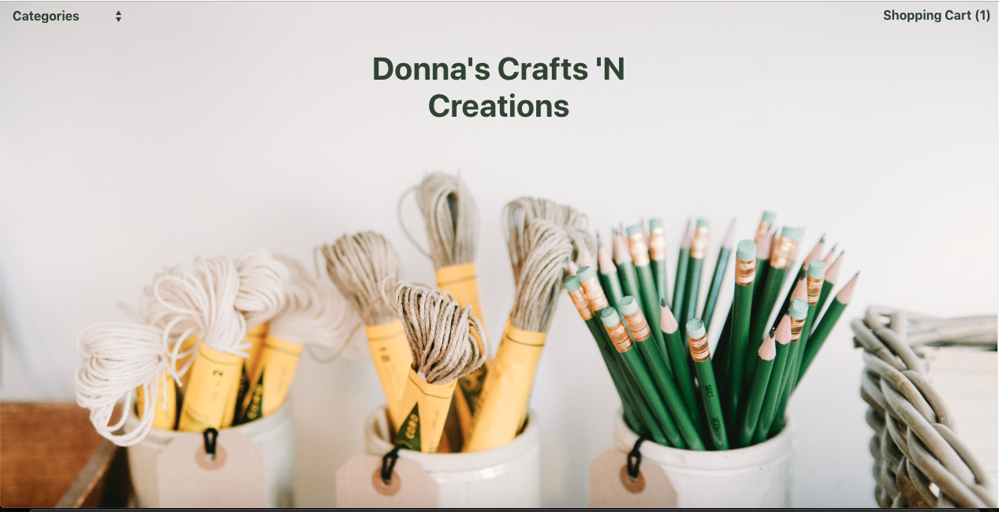
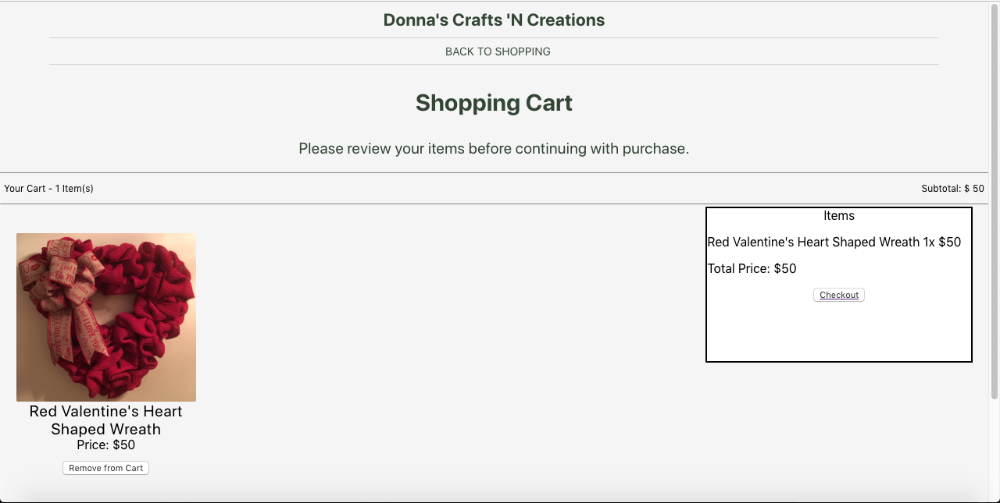
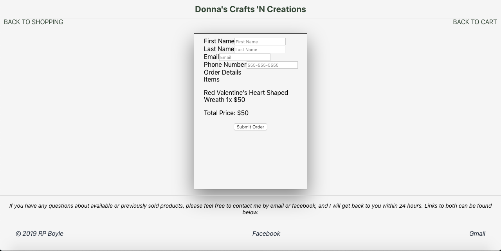
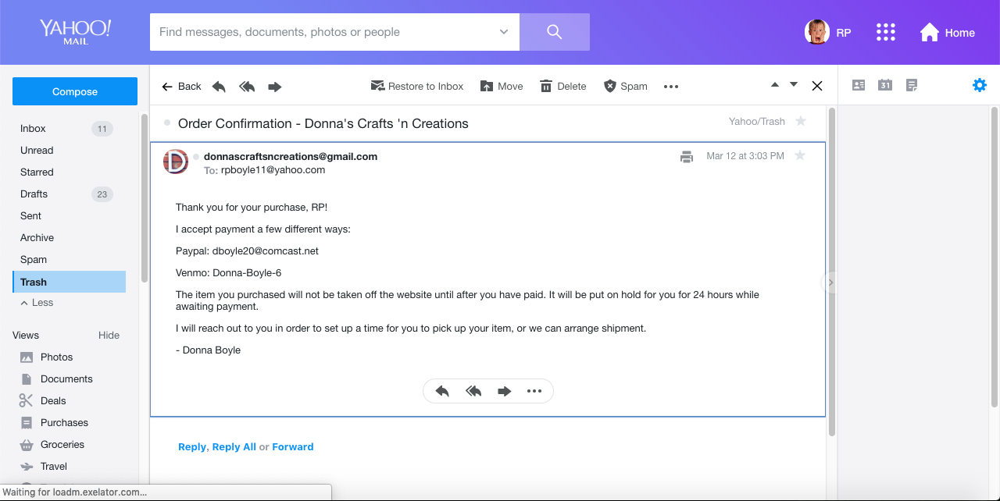

# Donna's Crafts 'N Creations

## Summary of App

This is a retail site for people that have a love for creative crafts can go and shop.  All of the items on this site are provided by a  local wreath and decoration designer, Donna Boyle.  She makes all of her wreaths and decorations by creating them from scratch or repurposing everyday items like: shovels, fan blades, shutters, siding and more.  If you love decorating your home for every holiday, and also enjoy helping out small business owners, this is the place for you.

### Live App on Heroku:
https://dcnc-client.herokuapp.com/

### Link to Server:
https://github.com/thinkful-ei26/RP-DCaC-server

### Features:
1. User can search through all of the available items that the store has to offer.
2. User can add items to a shopping cart so that you can keep track of all the items you wish to buy.
3. User can checkout on this site and get an email with information about how to pay with Venmo or PayPal (items will not be sent to owners until payment has been received).

### Landing Page Screenshot:


### Shopping Cart Page Screenshot:


### Checkout Page Screenshot:


### Confirmation Email After Purchase Screenshot:


### Technical Stack:
- React for Frontend
- Redux for State Management
- Node and Express for backend
- MongoDB for the database

### File Tree:
``` bash
├──node_modules
├──.env
├──.gitignore
├──package-lock.json
├──package.json
├──README.md
├──public
│   ├──index.html
│   ├──manifest.json
│   ├──favicon.ico
├──src
│   ├──actions
│   │   ├──index.js
│   ├──components
│   │   ├──buttons
│   │   │   ├──Account.css
│   │   │   ├──Account.js
│   │   │   ├──Menu.css
│   │   │   ├──Menu.js
│   │   │   ├──Search.css
│   │   │   ├──Search.js
│   │   │   ├──ShoppingCart.css
│   │   │   ├──ShoppingCart.js
│   │   │   ├──WishList.js
│   │   ├──items
│   │   │   ├──Items.css
│   │   │   ├──Items.js
│   │   ├──userInfo
│   │   │   ├──AccountInfo.css
│   │   │   ├──AccountInfo.js
│   │   │   ├──Login.js
│   │   ├──App.js
│   │   ├──Cart.css
│   │   ├──Cart.js
│   │   ├──Checkout.css
│   │   ├──Checkout.js
│   │   ├──Footer.css
│   │   ├──Footer.js
│   │   ├──Home.css
│   │   ├──Home.js
│   │   ├──Nav.css
│   │   ├──Nav.js
│   │   ├──Paypal.css
│   │   ├──Paypal.js
│   ├──reducers
│   ├──config.js
│   ├──index.css
│   ├──index.js
│   ├──serviceWorker.js
│   ├──store.js
│   ├──validators.js
```
